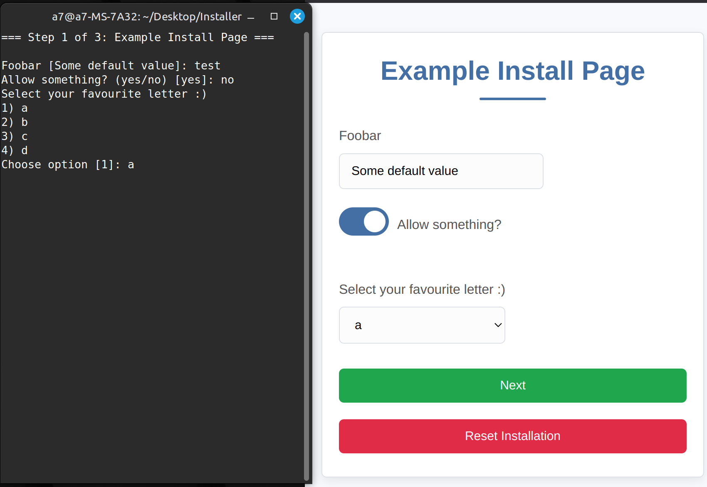

# PHP Project Installer: CLI & Browser Support

[](LICENSE)  <!-- Add your license file -->
Please leave a star ⭐ 😅!
This project provides a streamlined and flexible installation system for PHP projects.  It uniquely supports both **Command Line Interface (CLI)** and **Browser-based** installation using the *same underlying code*, eliminating code duplication and simplifying maintenance.  It's designed for rapid development and easy integration into new or existing PHP projects.

### Browser


### CLI (Without changing code)


## Key Features

*   **Unified CLI and Browser Support:**  The core logic works seamlessly in both CLI and browser environments.  This reduces boilerplate and ensures consistent behavior.
*   **Backend-Driven:** No need to write separate frontend code. The installer handles UI generation automatically based on your backend configuration.
*   **"Plug and Play" Installation Pages:**
    *   Create new installation steps by simply adding classes in the `InstallControllers` folder.
    *   Implement the `InstallControllerInterface`.
    *   The system automatically detects and integrates these controllers into both the CLI and browser installers.
* **Priority-Based Ordering**
    * Control the installation page order.
    * lower number is higher proiority, so its on top of the install-page stack.
*   **Dynamic Field Generation:**
    *   Define input fields (text, checkboxes, selects, info-text) within your controller's `getFields()` method.
    *   The installer automatically renders these fields in both the CLI and browser interfaces.
    *   Easily extendable with custom field types.
*   **Built-in Navigation Handling:**
    *   `nextTriggered()`, `backTriggered()`, and `resetTriggered()` methods provide control over navigation and allow for validation and data processing.
*   **Event Broadcasting (Reset):** The `resetTriggered()` method broadcasts an event to all controllers, enabling actions like database table removal.
*   **Stored Values:** Values are Stored in the session, so they can restored easiely if you navigate through the pages.
*   **CSRF:** CSRF token prevents unauthorized actions by ensuring that only legitimate requests from authenticated users are accepted.
*   **PHP 7.x and 8.x support**: Supports php 7.x and 8.x for more flexibility.

## Installation & Setup

1.  **Clone the Repository:**

    ```bash
    git clone <repository-url>
    ```

2.  **Include in Your Project:**
Unfortunately, you cannot add this project to Composer vendor directory because the installation directory must either be renamed or deleted for security reasons. Renaming a dependency in the vendor directory would likely be considered "bad practice." For this purpose, I created a custom autoloader. So you can use it alongside with composer.
Here are the steps that I believe are the correct way to proceed:
- Clone this project.
- Place the installer in an appropriate location (such as /src or /app).
- Open your main index.php file where you have the Composer autoloader.php.

```
Your Project
├── src
│   └── Installer // Cloned Directory
│       └── index.php 
├── public
│   └── index.php // Main index.php
│
```
```php
<?php
// - Place this if statement at the top of your main index.php
// - Ensure the path is correct.
if (file_exists(__DIR__ . "/../src/Installer")) { // Installer folder exists!
    require_once __DIR__ . '/../src/Installer/index.php';
    exit; // Block further execution
}
```

Now, when you open the main index.php or your web server's entry point, the installer should automatically load the "install" index.php. If you want to use CLI mode, simply run php index.php where your "main" index.php are. This approach does not conflict with your Composer autoloader.


## Creating Installation Steps (Controllers)

The core of the installer lies in creating `InstallController` classes.  Here's a breakdown of how to create a new installation step:

1.  **Create a Controller:**

    *   Create a new PHP class file within the `InstallControllers` directory.
    *   The class name should follow the pattern `ExampleInstallController` (e.g., `DatabaseSetupController`, `UserCreationController`).
    *   The class *must* implement the `InstallControllerInterface`.

2.  **Implement the Interface Methods:**

    ```php
    <?php

    namespace InstallControllers;

    use Core\InstallControllerInterface;
    use Core\InstallFeedback; // Import the InstallFeedback class

    class SampleInstallController implements InstallControllerInterface
    {
        public function getPriority(): int
        {
            // Lower values = earlier in the installation process (e.g., -10 for a welcome page).
            // Higher values = later in the process (e.g., 10 for a completion page).
            return -3;
        }

        public function initialize()
        {
            // Optional: Code to execute *after* the page is rendered.  Usually not needed.
        }

        public function getFields(): array
        {
            // Define the input fields for this step.
            return [
                'db_host' => [
                    'type' => 'text',
                    'label' => 'Database Host',
                    'value' => 'localhost', // Default value
                    'required' => true // Add required attribute
                ],
                'db_name' => [
                    'type' => 'text',
                    'label' => 'Database Name',
                    'value' => '',
                    'required' => true
                ],
                'db_user' => [
                    'type' => 'text',
                    'label' => 'Database User',
                    'value' => '',
                    'required' => true
                ],
                'accept_terms' => [
                    'type' => 'checkbox',
                    'label' => 'I accept the terms and conditions',
                    'value' => false, // Default: unchecked
                    'required' => true // Example of required checkbox
                ],
                'fav_letter' => [
                    'type' => 'select',
                    'label' => 'Select your favorite letter:',
                    'value' => 'b', // Default selection
                    'options' => ['a' , 'b' , 'c' ], // Options with labels
                    'required' => true // Example of required select
                 ],
                  'some_info' => [
                     'type' => 'info',
                     'label' => 'Important Information',
                     'value' => 'This is some important information for the user.'
                  ]
            ];
        }

        public function taskName(): string
        {
            // The title of this installation step.
            return 'Database Setup';
        }

        public function resetTriggered()
        {
            // Handle reset actions (e.g., clear database tables).
            // This is broadcast to *all* InstallControllers.
        }

        public function nextTriggered(array $postValues)
        {
            // Handle "Next" button press.
            //  - Validate input from $postValues.
            //  - Perform actions (e.g., save to database, create files).

            // Example validation:
            if (empty($postValues['db_host'])) {
                return new InstallFeedback('error', 'Database host is required.');
            }

            // ... more validation and actions ...

            // If successful, return nothing to proceed to the next step.
        }

        public function backTriggered(array $postValues)
        {
            // Handle "Back" button press.  Usually, you'll just return nothing to go back.
            // You might want to add validation or cleanup here if needed.
        }
    }
    ```

3.  **Field Types:**

    *   **`text`:** Standard text input.
    *   **`checkbox`:** Checkbox (true/false).
    *   **`select`:** Dropdown select box.
        *   `options`: An associative array where keys are the values and values are the labels displayed in the dropdown.
    *    **`info`:** Displays plain text information.
    *   **Adding Custom Types:**
        1.  Create a new `.php` file in the `Templates/fields` directory (e.g., `mycustomfield.php`).
        2.  This file should contain the HTML to render your custom field, using the `$field` variable (which will contain the configuration from `getFields()`).
        3.  To support the new type in the CLI, add a corresponding `case` in `CliInstaller.php`.

4. CLI and Browser

